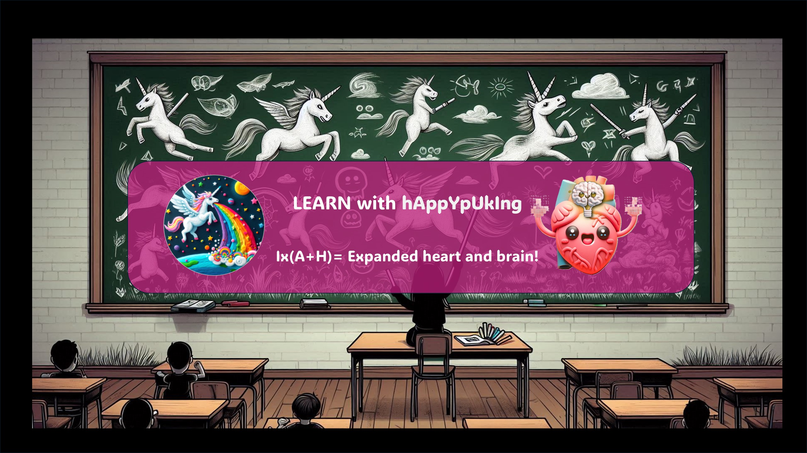

### hAppYpUkIng — Lab

> **Ix(A+H) = Expanded heart and brain!**  
> Recursos educativos interactivos, abiertos y gratuitos para mentes que aprenden diferente.

---

## ¿Qué es esto?

hAppYpUkIng nació de una necesidad real: crear materiales que funcionaran de verdad para estudiantes que piensan distinto o simplemente con dificultad para conectar con los formatos convencionales.

Empezó en casa, para mis hijos. Lo que funcionó, lo comparto con todos.

Aquí no hay PDFs estáticos ni libros de texto digitalizados.  
Aquí hay recursos interactivos que el alumno puede explorar a su ritmo, desde distintos puntos de entrada, con retroalimentación visual inmediata.

Todo el contenido está alineado con el currículo oficial de la ESO (España).

---

## 📁 Estructura del repo

```
happypuking-lab/
├── Reinos/
│   └── bio-5reinos.html              # Explorador interactivo de los 5 Reinos
├── Reino Plantas/
│   └── bio-reinoplantas.html         # Tema 6 ESO — Reino de las Plantas
├── Quimica/
│   └── tabla_periodica.html          # Tabla periódica interactiva
├── Mates/
│   └── tabla-pitagorica.html         # Tablas de multiplicar interactivas
├── Lengua/
│   └── sintaxis.html                 # Morfosintaxis — explorador y analizador
├── Ingles/
│   └── verbos_irregulares.html       # Verbos irregulares — explorador de familias
├── Tiempo/
│   └── reloj.html                    # El Reloj · The Clock — fracciones y tiempo
└── ND/
    └── sensory_overload_model.html   # Modelo de Carga Sensorial — DPS / TEA
```

---

## 🧪 Recursos disponibles

### ✅ Publicados

| Recurso                             | Materia                   | Nivel             | Archivo                               |
| ----------------------------------- | ------------------------- | ----------------- | ------------------------------------- |
| Explorador de los 5 Reinos          | Ciencias Naturales        | 1º ESO            | `Reinos/bio-5reinos.html`             |
| Reino de las Plantas                | Ciencias Naturales        | 1º ESO            | `Reino Plantas/bio-reinoplantas.html` |
| Tabla Periódica                     | Química                   | ESO               | `Quimica/tabla_periodica.html`        |
| Tablas de Multiplicar               | Matemáticas               | Primaria / 1º ESO | `Mates/tabla-pitagorica.html`         |
| Morfosintaxis — Explorador          | Lengua Castellana         | ESO               | `Lengua/sintaxis.html`                |
| Verbos Irregulares Inglés           | Inglés                    | ESO               | `Ingles/verbos_irregulares.html`      |
| El Reloj · The Clock                | Matemáticas · Tiempo      | Primaria / ESO    | `Tiempo/reloj.html`                   |
| Modelo de Carga Sensorial           | Neurodivergencia          | Divulgativo       | `ND/sensory_overload_model.html`      |

### 🔧 En desarrollo

| Recurso                         | Materia           | Nivel     |
| ------------------------------- | ----------------- | --------- |
| Verbos irregulares español      | Lengua Castellana | ESO       |
| Chuletarios interactivos        | Todas             | VARIOS    |

---

## 🧠 Sección ND — Neurodivergencia

Recursos explicativos sobre neurodivergencia — no clínicos, no diagnósticos.  
Pensados para entender, comunicar y reducir la brecha entre quien lo vive y quien no.

**Modelo de Carga Sensorial** — herramienta interactiva sobre prefiltrado sensorial y sobrecarga en perfiles DPS / TEA.  
Explica el desajuste entre el input disponible y la capacidad de atenuación automática.  
Incluye amortiguadores naturales y conductuales, factores de coste adicional (masking, sobrecarga ejecutiva, falta de previsibilidad) y comparativa NT / DPS en tiempo real.  
No es un test. No es un diagnóstico. Es para entender y explicar.

---

## 🎮 ¿Cómo funcionan los recursos?

Los recursos son archivos HTML autocontenidos — sin instalación, sin login, sin servidor.  
Se abren directamente en el navegador. También funcionan **sin conexión** — descarga el archivo y úsalo donde quieras.

Cada recurso incluye múltiples modos de navegación cuando el contenido lo justifica:

- **Modo explorador** — navegación libre por secciones
- **Modo historia** — recorrido guiado paso a paso con narración

---

## 🗂 Contenido extensible con YAML

Algunas herramientas separan el contenido del código mediante archivos YAML. Esto permite:

- Añadir o modificar contenido sin tocar el HTML
- Generar nuevas oraciones o ejercicios con un chatbot usando la plantilla incluida
- Adaptar los recursos a cualquier nivel o contexto sin conocimientos técnicos avanzados

Plantilla y prompt de ejemplo incluidos en cada herramienta que lo soporte.

---

## 🎨 Identidad visual

Fondo oscuro · Verde bioluminiscente · Tipografía Unbounded  
Diseño pensado para reducir fatiga visual y maximizar contraste.  
Weird, pero funcional. Así somos.

---

##  Otros recursos

#### [ARKINESIS](https://v0raonline.github.io/arkinesis/)

Simulador de física interactivo para Bachillerato.

---

## 📺 Canal de YouTube

[@h4ppypuk1ng](https://www.youtube.com/@h4ppypuk1ng) — vídeos y contando.

---

## 📬 Contacto

¿Preguntas, colaboraciones o simplemente quieres decir algo?  
✉️ [h4ppypuk1ng@gmail.com](mailto:h4ppypuk1ng@gmail.com)

---

## 📄 Licencia

[CC BY-NC-SA 4.0](https://creativecommons.org/licenses/by-nc-sa/4.0/)  
Puedes usar, adaptar y compartir — siempre que sea sin fines comerciales y mantengas esta misma licencia.  
Cita la fuente. Es lo mínimo.

---

## 🤝 Contribuciones

¿Tienes una idea o encontraste un error?  
Abre un issue o un PR. Esto es un taller abierto, no un producto terminado.

[Issues · V0raOnline/happypuking-lab](https://github.com/V0raOnline/happypuking-lab/issues)

---

## 🦄 Sobre el proyecto

Lee el [ABOUT.html](./ABOUT.html) para entender de dónde viene esto, por qué se llama así y quién hay detrás.

Spoiler: una persona, un cerebro lokito y una IA bien entrenada.

---

*Built with AI, with intention, and with lived experience.*  
*For those who've heard "you're just not trying hard enough" one too many times.*
