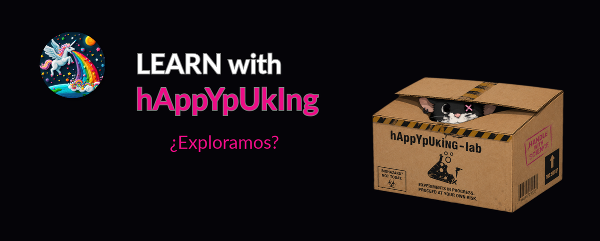

### hAppYpUkIng — Lab

> **Ix(A+H) = Expanded heart and brain!**  
> Recursos educativos interactivos, abiertos y gratuitos para mentes que aprenden diferente.

---

## ¿Qué es esto?

hAppYpUkIng nació de una necesidad real: crear materiales que funcionaran de verdad para estudiantes que piensan distinto o simplemente con dificultad para conectar con los formatos convencionales.

Empezó en casa, para mis hijos. Lo que funcionó, lo comparto con todos.

Aquí no hay PDFs estáticos ni libros de texto digitalizados.  
Aquí hay recursos interactivos que el alumno puede explorar a su ritmo, desde distintos puntos de entrada, con retroalimentación visual inmediata.

Todo el contenido está alineado con el currículo oficial de la ESO (España).

---

## 🚪 ¿Qué necesitas hoy?

La portada no empieza por el catálogo. Empieza por el problema.

Nadie llega a un laboratorio solo a explorar. Se llega un martes con algo
concreto: *no se saben las tablas*, *la formulación parece magia negra*,
*confunden CD, CI y atributo*. Catorce entradas escritas así, cada una
apuntando a la herramienta que sirve para eso.

El catálogo por materias sigue estando, justo debajo. Pero primero se
pregunta qué duele.

---

## 📁 Estructura del repo

Las carpetas usan un prefijo de tres letras por materia, y cada archivo
repite ese prefijo. Así se sabe de dónde viene un fichero solo con verlo.

```
happypuking-lab/
├── index.html                          # Portada — catálogo de todas las herramientas
├── about.html                          # De dónde viene esto y por qué
├── bio/                                # Biología
│   ├── bio-5reinos.html                # Los 5 Reinos — explorador de conexiones
│   ├── bio-invertebrados-mapa.html     # Invertebrados — mapa de los 6 grupos
│   ├── bio-invertebrados-tarjetas.html # Invertebrados — tarjetas
│   └── bio-reino-plantas.html          # Reino de las Plantas — explorador e historia
├── ing/                                # Inglés
│   ├── ing-verbos-irregulares.html     # Familias fonológicas de verbos irregulares
│   ├── ing-verbos-quiz.html            # Quiz de verbos — con banco de frases en YAML
│   ├── ing-grammar-builder.html        # Construir oraciones pieza a pieza
│   ├── ing-timeline.html               # Mapa de metro de los tiempos verbales
│   └── ing-sing-and-learn.html         # Patrones de verbos cantando
├── len/                                # Lengua
│   └── len-morfosintaxis.html          # Morfosintaxis — explorador y analizador
├── mat/                                # Matemáticas
│   └── mat-tabla-pitagorica.html       # Tabla pitagórica — patrones y simetría
├── qui/                                # Química
│   ├── qui-tabla-periodica.html        # Tabla periódica — 3 modos de lectura
│   └── qui-elementos-tarjetas.html     # Tarjetas de elementos — práctica
├── nd/                                 # Neurodivergencia
│   ├── nd-carga-sensorial.html         # Modelo de Carga Sensorial (ES)
│   └── nd-carga-sensorial-en.html      # Sensory Load Model (EN)
└── trn/                                # Transversal
    └── trn-reloj.html                  # El Reloj · The Clock — bilingüe
```

Una carpeta, una materia, un prefijo. La referencia siempre es lo que enlaza
`index.html`: aquí no hay copias de seguridad ni versiones paralelas — para
eso está el historial de git.

---

## 🧪 Recursos disponibles

### ✅ Publicados

| Recurso                   | Materia              | Nivel             | Archivo                               |
| ------------------------- | -------------------- | ----------------- | ------------------------------------- |
| Los 5 Reinos              | Ciencias Naturales   | 1º ESO            | `bio/bio-5reinos.html`                |
| Invertebrados             | Ciencias Naturales   | 1º ESO            | `bio/bio-invertebrados-mapa.html`     |
| Reino de las Plantas      | Ciencias Naturales   | 1º ESO            | `bio/bio-reino-plantas.html`          |
| Invertebrados — tarjetas  | Ciencias Naturales   | 1º ESO            | `bio/bio-invertebrados-tarjetas.html` |
| Verbos Irregulares        | Inglés               | ESO               | `ing/ing-verbos-irregulares.html`     |
| Quiz de Verbos            | Inglés               | ESO               | `ing/ing-verbos-quiz.html`            |
| Grammar Builder           | Inglés               | ESO               | `ing/ing-grammar-builder.html`        |
| Timeline de Tiempos       | Inglés               | ESO               | `ing/ing-timeline.html`               |
| Sing & Learn              | Inglés               | ESO               | `ing/ing-sing-and-learn.html`         |
| Morfosintaxis             | Lengua Castellana    | ESO               | `len/len-morfosintaxis.html`          |
| Tabla Pitagórica          | Matemáticas          | Primaria / ESO    | `mat/mat-tabla-pitagorica.html`       |
| Tabla Periódica           | Química              | ESO               | `qui/qui-tabla-periodica.html`        |
| Tarjetas de Elementos     | Química              | ESO               | `qui/qui-elementos-tarjetas.html`     |
| El Reloj · The Clock      | Matemáticas · Tiempo | Primaria / ESO    | `trn/trn-reloj.html`                  |
| Modelo de Carga Sensorial | Neurodivergencia     | Divulgativo       | `nd/nd-carga-sensorial.html`          |
| Sensory Load Model (EN)   | Neurodivergencia     | Divulgativo       | `nd/nd-carga-sensorial-en.html`       |

### ⚗️ Química — el viaje hacia la formulación

Las dos herramientas de Química están pensadas como una secuencia, no como
piezas sueltas. La idea es que formular deje de ser memorizar.

La **Tabla Periódica** se lee en tres capas, con el mismo tablero:

1. **Familias** — reconocer el territorio: quién es quién y de qué familia.
2. **Valencia** — cuántos electrones tiene cada átomo en la última capa, que
   es lo único que cuenta al unirse. Se ve que cada columna comparte valencia.
3. **Electronegatividad** — con cuánta fuerza los agarra. La diagonal que
   explica la forma de la tabla.

Las **Tarjetas de Elementos** cierran el ciclo: practicar símbolos, nombres,
familias y electrones de valencia, con filtro por familia y lista de fallos
para repasar.

### 🔢 Matemáticas — la tabla pitagórica no es una lista

Tres modos sobre el mismo tablero, porque son tres cosas distintas:

1. **Explorar** — ver el patrón. No son 100 resultados, son 55: la diagonal
   es un espejo. Eso se ve antes de repetir nada.
2. **Minas gemelas** — practicar la multiplicación. Cada resultado aparece
   dos veces, y descubrir uno descubre su gemelo.
3. **Caza topos** — factorización al revés: te damos el 12 y buscas 3×4, 2×6.
   Es lo que hace falta después para dividir.

### ⏱ Ritmos — parar a pensar no es fallar

Las herramientas de práctica tienen dos ritmos, y se elige antes de empezar:

- **No me estreses** — sin cuenta atrás. El reloj cuenta hacia arriba y no
  pasa nada.
- **Contra reloj** — con cuenta atrás, pero con un botón **«Estoy pensando»**
  que la congela sin penalizar. Pensar no descuenta.

Además, tras tres fallos seguidos aparece un **respiro** automático, y hay una
salida explícita —**«Me aburro»**— para dejarlo sin sensación de abandono.

Ninguna herramienta guarda nada en ningún sitio ni pide una cuenta.

### 🔗 Enlaces directos a un modo

Los modos se pueden enlazar. Sirve para mandarle a alguien exactamente lo que
necesita, no la portada:

```
mat/mat-tabla-pitagorica.html?modo=minas      # practicar multiplicación
mat/mat-tabla-pitagorica.html?modo=caza       # factorizar
qui/qui-elementos-tarjetas.html?modo=sym2name # símbolo → nombre
qui/qui-elementos-tarjetas.html?modo=family   # ¿de qué familia?
qui/qui-elementos-tarjetas.html?modo=valence  # electrones de valencia
```

### 🔧 En desarrollo

| Recurso                    | Materia           | Nivel  |
| -------------------------- | ----------------- | ------ |
| Formulador de compuestos   | Química           | ESO    |
| Verbos irregulares español | Lengua Castellana | ESO    |
| Chuletarios interactivos   | Todas             | VARIOS |

---

## ⭐ Si te sirve, deja una estrella

No cuesta nada, no me da tu correo y no te suscribe a nada. Es la única señal
que me llega de que al otro lado hay alguien: una manera muy estúpida de decir
"te he visto, y me gusta lo que estás haciendo".

Si te has llevado algo de aquí, déjala. Se tarda un segundo.

---

## 🧠 Sección ND — Neurodivergencia

Recursos explicativos sobre neurodivergencia — no clínicos, no diagnósticos.  
Pensados para entender, comunicar y reducir la brecha entre quien lo vive y quien no.

**Modelo de Carga Sensorial** — herramienta interactiva sobre prefiltrado sensorial y sobrecarga en perfiles DPS / TEA.  
Explica el desajuste entre el input disponible y la capacidad de atenuación automática.  
Incluye amortiguadores naturales y conductuales, factores de coste adicional (masking, sobrecarga ejecutiva, falta de previsibilidad) y comparativa NT / DPS en tiempo real.  
No es un test. No es un diagnóstico. Es para entender y explicar.

---

## 🎮 ¿Cómo funcionan los recursos?

Los recursos son archivos HTML autocontenidos — sin instalación, sin login, sin servidor.  
Se abren directamente en el navegador. También funcionan **sin conexión** — descarga el archivo y úsalo donde quieras.

Cada recurso incluye múltiples modos de navegación cuando el contenido lo justifica:

- **Modo explorador** — navegación libre por secciones
- **Modo historia** — recorrido guiado paso a paso con narración

---

## 🗂 Contenido extensible con YAML

Algunas herramientas separan el contenido del código mediante archivos YAML. Esto permite:

- Añadir o modificar contenido sin tocar el HTML
- Generar nuevas oraciones o ejercicios con un chatbot usando la plantilla incluida
- Adaptar los recursos a cualquier nivel o contexto sin conocimientos técnicos avanzados

Plantilla y prompt de ejemplo incluidos en cada herramienta que lo soporte.

---

## 🎨 Identidad visual

Fondo oscuro · Tipografía Unbounded · Diseño pensado para reducir fatiga
visual y maximizar contraste.

El color significa algo y siempre lo mismo, en las once herramientas:

| Color       | Qué dice                                        |
| ----------- | ----------------------------------------------- |
| **Magenta** | Identidad del laboratorio · navegación           |
| **Cian**    | El control activo · el foco del teclado          |
| **Ámbar**   | Apoyo: pausar, pensar, pedir pista, dejarlo      |
| **Verde**   | Correcto · confirmar                             |
| **Rojo**    | Error                                            |

Dos reglas que lo sostienen: los colores de dato viven en el tablero y los de
control en los bordes; y **el color nunca es lo único que dice el estado**,
siempre hay texto que lo acompaña. Verde y ámbar son el par peor distinguido
en deuteranopia y son dos de nuestros significados opuestos.

Weird, pero funcional. Así somos.

---

##  Otros recursos

#### [ARKINESIS](https://v0raonline.github.io/arkinesis/)

Simulador de física interactivo para Bachillerato.

---

## 🐀 Glitch

La mascota del laboratorio. Es una rata, porque las ratas saben encontrar
caminos incluso cuando el sitio está lleno de piezas que no encajan.

No dice si has acertado. Aparece en dos momentos y nada más: cuando paras a
pensar y cuando termina una ronda. No reacciona pregunta a pregunta —se probó
así y cansaba.

**Se puede esconder.** El interruptor está en la portada y vale para todo el
laboratorio de una vez.

---

## 📺 Canal de YouTube

[@h4ppypuk1ng](https://www.youtube.com/@h4ppypuk1ng) — vídeos y contando.

---

## 📬 Contacto

¿Preguntas, colaboraciones o simplemente quieres decir algo?  
✉️ [h4ppypuk1ng@gmail.com](mailto:h4ppypuk1ng@gmail.com)

---

## ☕ Invitar a un café

Todo esto es gratis y va a seguir siéndolo. Detrás no hay una startup: hay una
madre robando horas de sueño y pagando suscripciones.

Si algo de aquí te ha servido, te ha ahorrado tiempo o te ha salvado un examen,
puedes invitarme a un café.

**[ko-fi.com/v0raonline](https://ko-fi.com/v0raonline)**

Una cosa importante: las propinas no te suscriben a nada. No uso, exporto ni
almaceno los emails de quien apoya el proyecto. Solo quiero café, no que seamos
amigos para siempre.

---

## 📄 Licencia

[CC BY-NC-SA 4.0](https://creativecommons.org/licenses/by-nc-sa/4.0/)  
Puedes usar, adaptar y compartir — siempre que sea sin fines comerciales y mantengas esta misma licencia.  
Cita la fuente. Es lo mínimo.

---

## 🤝 Contribuciones

¿Tienes una idea o encontraste un error?  
Abre un issue o un PR. Esto es un taller abierto, no un producto terminado.

[Issues · V0raOnline/happypuking-lab](https://github.com/V0raOnline/happypuking-lab/issues)

---

## 🦄 Sobre el proyecto

Lee el [about.html](./about.html) para entender de dónde viene esto, por qué se llama así y quién hay detrás.

Spoiler: una persona, un cerebro lokito y una IA bien entrenada.

---

*Built with AI, with intention, and with lived experience.*  
*For those who've heard "you're just not trying hard enough" one too many times.*
